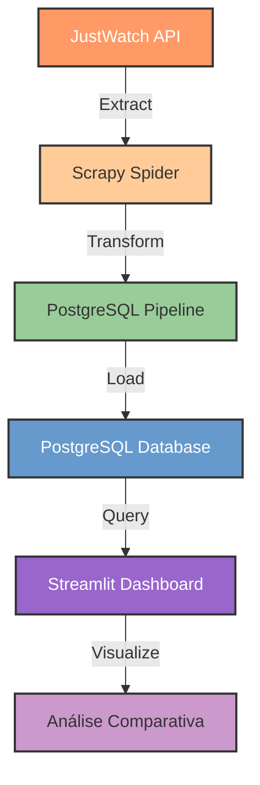

# JustWatch-Scrapy

Um sistema de engenharia de dados para análise comparativa de serviços de streaming, que extrai, transforma e carrega dados do JustWatch para um dashboard interativo.

## 📊 Sobre o Projeto

Este projeto implementa um pipeline completo de ETL (Extract, Transform, Load) para coletar dados sobre filmes e séries disponíveis em plataformas de streaming no Brasil, processar essas informações e disponibilizá-las através de um dashboard interativo para análise comparativa.

### Diagrama de ETL



## 🚀 Funcionalidades

- **Extração de Dados**: Coleta automatizada de dados sobre filmes e séries de diversas plataformas de streaming via API GraphQL do JustWatch.
- **Processamento de Dados**: Limpeza, transformação e enriquecimento dos dados extraídos.
- **Armazenamento Persistente**: Salvamento dos dados em banco PostgreSQL com esquema estruturado.
- **Dashboard Interativo**: Interface visual para explorar e comparar as plataformas de streaming em diversos aspectos:
  - Tamanho e diversidade do catálogo
  - Qualidade do conteúdo (notas IMDb)
  - Atualidade do catálogo
  - Relação custo-benefício
  - Análises técnicas (duração, classificação indicativa)

## 🛠️ Tecnologias Utilizadas

- **Scrapy**: Framework para extração de dados
- **PostgreSQL**: Banco de dados relacional
- **SQLAlchemy**: ORM para interação com o banco de dados
- **Pandas**: Processamento e análise de dados
- **Streamlit**: Desenvolvimento do dashboard interativo
- **Docker & Docker Compose**: Containerização e orquestração dos serviços
- **Python 3.12**: Linguagem de programação principal
- **Mermaid**: Visualização de diagramas
- **Plotly**: Biblioteca para visualização de dados interativos

## 📂 Estrutura do Projeto

```
JUSTWATCH-SCRAPY/
├── .ruff_cache/             # Cache do linter Ruff
├── src/                     # Código-fonte do projeto
│   ├── dashboard/           # Aplicação Streamlit
│   │   ├── app.py           # Código do dashboard
│   │   ├── Dockerfile       # Configuração do container
│   │   └── requirements.txt # Dependências
│   ├── extract/             # Módulo de extração de dados
│       ├── .scrapy/         # Cache e arquivos do Scrapy
│       ├── extract/         # Código do spider
│       ├── Dockerfile       # Configuração do container
│       ├── requirements.txt # Dependências
│       └── scrapy.cfg       # Configuração do Scrapy
├── tests/                   # Testes automatizados
├── .env                     # Variáveis de ambiente
├── .gitignore               # Arquivos ignorados pelo Git
├── docker-compose.yml       # Configuração dos serviços
├── init.sql                 # Script de inicialização do banco
├── load_git.bat             # Script auxiliar
├── poetry.lock              # Lock de dependências do Poetry
├── pyproject.toml           # Configuração do projeto
└── README.md                # Documentação do projeto
```

## 🏁 Como Executar

### Pré-requisitos

- Docker e Docker Compose instalados

### Passos para execução

1. Clone o repositório:
   ```bash
   git clone https://github.com/seu-usuario/justwatch-scrapy.git
   cd justwatch-scrapy
   ```

2. Execute o projeto com Docker Compose:
   ```bash
   docker-compose up -d
   ```

3. Acesse o dashboard:
   ```
   http://localhost:8501
   ```

### Serviços

- **Database**: PostgreSQL rodando na porta 5432
- **Scrapy**: Serviço de extração de dados
- **Dashboard**: Interface Streamlit acessível na porta 8501

## 📊 Dashboard

O dashboard interativo permite:

- Comparar o tamanho dos catálogos entre plataformas
- Analisar a qualidade do conteúdo com base em avaliações do IMDb
- Verificar a atualidade do conteúdo em cada plataforma
- Examinar a relação custo-benefício dos serviços
- Visualizar a distribuição de filmes e séries por categoria
- Analisar características técnicas como duração e classificação indicativa

## 📃 Detalhes Técnicos

### Extração de Dados

O sistema utiliza a API GraphQL do JustWatch para obter informações sobre filmes e séries disponíveis nas plataformas de streaming. O spider Scrapy foi desenvolvido para paginar através dos resultados e extrair metadados detalhados de cada título.

### Processamento de Dados

Os dados extraídos passam por um pipeline de transformação que:
- Formata a duração dos conteúdos
- Padroniza valores nulos
- Adiciona timestamp da extração
- Prepara os dados para armazenamento persistente

### Plataformas Suportadas

- Netflix
- Amazon Prime Video
- Disney+
- MAX (anteriormente HBO Max)
- Paramount+
- Apple TV+
- Globoplay

> **Nota importante**: As mensalidades consideradas para a análise de custo-benefício são sempre os planos mais baratos (geralmente com anúncios) disponíveis até o dia 1/05/2025. Caso deseje atualizar os valores, edite o arquivo `init.sql`.

> **Atenção**: A API do JustWatch está sujeita a mudanças sem aviso prévio, o que pode quebrar o processo de coleta de dados. Este projeto pode requerer manutenção periódica para se adaptar a eventuais mudanças na estrutura da API GraphQL.

## 🤝 Contribuição

Este é um projeto educacional para demonstração de habilidades em engenharia de dados. Contribuições são bem-vindas através de pull requests.

## 📝 Banco de Dados

O projeto utiliza PostgreSQL com duas tabelas principais:

```sql
CREATE TABLE IF NOT EXISTS streaming_s.justwatch_tb (
	id SERIAL PRIMARY KEY,
	provedor VARCHAR(50) NOT NULL,
	categoria VARCHAR(20) NOT NULL,
	titulo VARCHAR(200),
	ano INTEGER,
	duracao VARCHAR(50),
	duracao_minutos INTEGER,
	imdb_score FLOAT,
	imdb_count INTEGER,
	classificacao VARCHAR(20),
	sinopse TEXT,
	url VARCHAR(500),
	extract_timestamp TIMESTAMP without time zone 
);

CREATE TABLE IF NOT EXISTS streaming_s.provider_tb (
	provedor_id CHAR(3) PRIMARY KEY,
	provedor VARCHAR(50) NOT NULL UNIQUE,
	mensalidade numeric
);
```

Os valores iniciais para o custo das mensalidades são:

```sql
INSERT INTO
	streaming_s.provider_tb (provedor_id, provedor, mensalidade)
VALUES
	('dnp', 'disney-plus', 27.99),
	('nfx', 'netflix', 20.90),
	('prv', 'amazon-prime-video', 19.90),
	('mxx', 'max', 29.90),
	('pmp', 'paramount-plus', 18.90),
	('atp', 'apple-tv-plus', 21.90),
	('gop', 'globoplay', 22.90);
```

## 📝 Licença

Este projeto está sob a licença MIT.